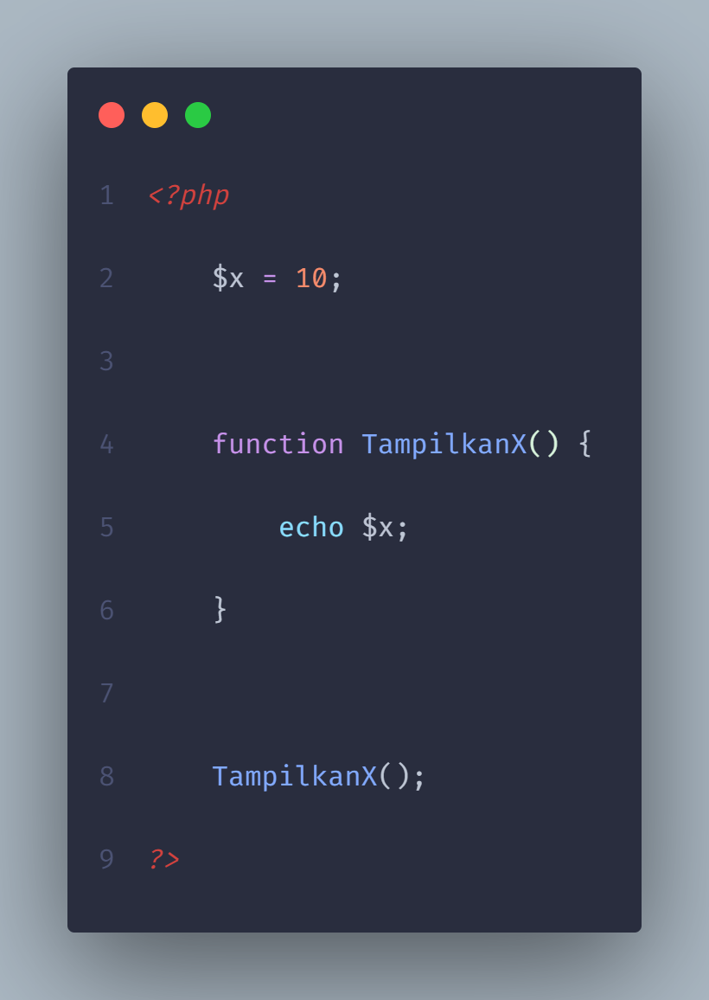
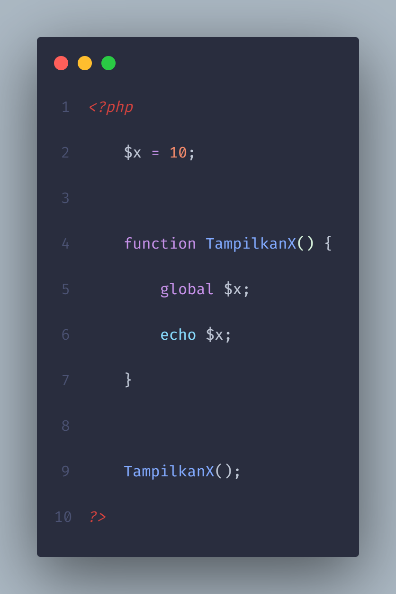

# Variable Scope In PHP

Variable scope adalah cakupan luas Variable yang bisa di akses atau di gunakan, di dalam php terdapat beberapa tipe variable scope yaitu :

- global
- local
- static

# Global variable 
Global variable di dalam php di deklarasikan di luar function atau cakupan tertentu dan hanya bisa di akses di luar

Kode tersebut akan menghasilkan error karena PHP tidak mengenali variable $x itu apa meskipun sudah di deklarasikan di baris 2 karena variabel $x berada diluar function TampilkanX(), untuk mengakses variable $x maka di gunakan di luar function TampilkanX().

## global keyword

Agar variable $x bisa digunakan di dalam function TampilkanX() gunakan keyword seperti gambar dibawah.

Dengan menggunakan keyword globak maka PHP mengenali variable $x dan program tidak terjadi error.

